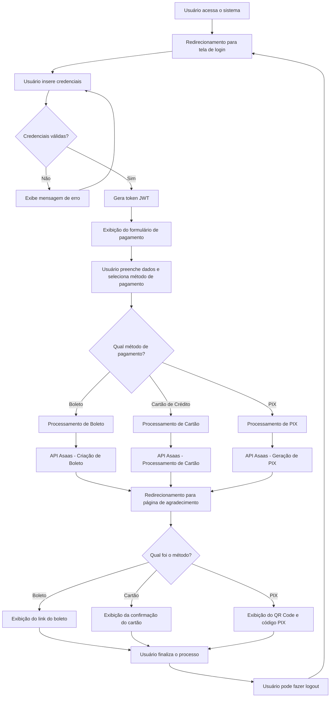

# Sistema de Processamento de Pagamentos - Asaas API

Este projeto é um sistema de processamento de pagamentos integrado ao ambiente de homologação do Asaas. O sistema permite que o cliente acesse uma página onde pode selecionar a opção de pagamento entre Boleto, Cartão ou Pix.

## Funcionalidades

- Autenticação JWT OAuth com tela de login
- Processamento de pagamentos com boleto, cartão de crédito e pix
- Validação de dados do formulário
- Exibição de boleto para pagamentos via boleto
- Exibição de QR Code e código Pix para pagamentos via Pix
- Mensagens amigáveis em caso de erro no processamento do pagamento

## Tecnologias Utilizadas

- PHP 8.x
- Laravel 10.x
- Bootstrap 5.x
- JWT (JSON Web Tokens) para autenticação
- Asaas API v3

## Requisitos

- PHP >= 8.1
- Composer
- Docker e Docker Compose (para o banco de dados)
- Extensões PHP: BCMath, Ctype, Fileinfo, JSON, Mbstring, OpenSSL, PDO, Tokenizer, XML

## Instalação

1. Clone o repositório:
```bash
git clone https://github.com/andreabreu76/payment-asaas-api.git
cd payment-asaas-api
```

2. Instale as dependências:
```bash
composer install
```

3. Copie o arquivo de ambiente:
```bash
cp .env.example .env
```

4. Configure o arquivo .env com suas credenciais do Asaas Sandbox:
```
ASAAS_API_KEY=sua_api_key_aqui
```

5. Gere a chave da aplicação:
```bash
php artisan key:generate
```

6. Inicie o banco de dados MySQL com Docker:
```bash
docker-compose up -d
```

7. Configure o banco de dados no arquivo .env e execute as migrações e seeders:
```bash
php artisan migrate --seed
```

8. Gere a chave JWT:
```bash
php artisan jwt:secret
```

9. Use o arquivo php.ini personalizado para evitar avisos de depreciação:
```bash
php -c php.ini artisan serve
```

10. Acesse o sistema em http://localhost:8000

11. (Opcional) Acesse o phpMyAdmin em http://localhost:8080 para gerenciar o banco de dados

## Docker

Este projeto utiliza Docker para fornecer um ambiente de banco de dados MySQL consistente. O arquivo `docker-compose.yml` define dois serviços:

1. **MySQL**: Banco de dados MySQL 8.0 para armazenar os dados da aplicação
2. **phpMyAdmin**: Interface web para gerenciar o banco de dados MySQL

O banco de dados MySQL é configurado para ser acessível em `127.0.0.1:3306` com as seguintes credenciais:
- **Usuário**: laravel
- **Senha**: password
- **Banco de dados**: laravel

### Comandos Docker úteis

- Iniciar os containers:
```bash
docker-compose up -d
```

- Verificar o status dos containers:
```bash
docker-compose ps
```

- Parar os containers:
```bash
docker-compose down
```

- Ver logs dos containers:
```bash
docker-compose logs
```

### Configuração PHP

O projeto inclui um arquivo `php.ini` personalizado para resolver avisos de depreciação relacionados às configurações de sessão. Para usar este arquivo ao executar comandos PHP, use a opção `-c`:

```bash
php -c php.ini artisan <comando>
```

## Uso

### Autenticação

1. Acesse o sistema e você será redirecionado para a tela de login
2. Use as credenciais padrão:
   - Email: admin@example.com
   - Senha: admin
3. Após o login bem-sucedido, você será redirecionado para a página de pagamentos
4. Para sair do sistema, clique no botão "Logout" no canto superior direito

### Processamento de Pagamentos

1. Após o login, você verá o formulário de pagamento
2. Preencha o formulário com seus dados pessoais e o valor do pagamento
3. Selecione o método de pagamento (Boleto, Cartão de Crédito ou Pix)
4. Preencha os dados específicos do método de pagamento selecionado
5. Clique em "Finalizar Pagamento"
6. Você será redirecionado para a página de confirmação com as informações do pagamento

## Estrutura do Projeto

### Árvore de Diretórios

```
payment-asaas-api/
├── app/
│   ├── Http/
│   │   ├── Controllers/
│   │   │   ├── AuthController.php     # Controlador de autenticação
│   │   │   └── PaymentController.php  # Controlador principal para processamento de pagamentos
│   │   └── Resources/
│   │       └── PaymentResource.php    # Recurso para padronização das respostas da API
│   └── Models/
│       └── User.php                   # Modelo de usuário com suporte a JWT
├── database/
│   └── seeders/
│       ├── AdminUserSeeder.php        # Seeder para criar o usuário admin
│       └── DatabaseSeeder.php         # Seeder principal
├── resources/
│   └── views/
│       ├── auth/
│       │   └── login.blade.php        # Página de login
│       ├── layouts/
│       │   └── app.blade.php          # Template principal do layout da aplicação
│       └── payments/
│           ├── index.blade.php        # Página com formulário de pagamento
│           └── thank-you.blade.php    # Página de agradecimento após o pagamento
└── routes/
    └── web.php                        # Definição das rotas da aplicação
```

### Descrição dos Arquivos Principais

#### Autenticação

- `app/Models/User.php`: Modelo de usuário com suporte a JWT
  - Implementa a interface JWTSubject
  - Métodos para obter o identificador JWT e claims personalizados

- `app/Http/Controllers/AuthController.php`: Controlador responsável pela autenticação
  - `showLoginForm()`: Exibe o formulário de login
  - `login()`: Processa a tentativa de login e gera o token JWT
  - `logout()`: Encerra a sessão do usuário

- `resources/views/auth/login.blade.php`: Página de login
  - Formulário para autenticação com email e senha
  - Exibe credenciais padrão para facilitar o acesso

- `database/seeders/AdminUserSeeder.php`: Seeder para criar o usuário admin
  - Cria um usuário com credenciais admin@example.com:admin

#### Processamento de Pagamentos

- `app/Http/Controllers/PaymentController.php`: Controlador responsável pelo processamento de pagamentos
  - `index()`: Exibe o formulário de pagamento
  - `process()`: Processa o pagamento com base no método selecionado
  - `thankYou()`: Exibe a página de agradecimento com detalhes do pagamento
  - `createCustomer()`: Cria um cliente na API Asaas
  - `processBoleto()`: Processa pagamentos via boleto
  - `processCreditCard()`: Processa pagamentos via cartão de crédito
  - `processPix()`: Processa pagamentos via PIX

- `app/Http/Resources/PaymentResource.php`: Recurso para padronização das respostas da API

- `resources/views/layouts/app.blade.php`: Template principal do layout da aplicação
  - Inclui botão de logout para usuários autenticados

- `resources/views/payments/index.blade.php`: Página do formulário de pagamento
  - Formulário para coleta de dados pessoais
  - Seleção do método de pagamento (Boleto, Cartão de Crédito, PIX)
  - Campos específicos para cada método de pagamento

- `resources/views/payments/thank-you.blade.php`: Página de confirmação do pagamento
  - Exibe detalhes do pagamento
  - Para boleto: exibe link para visualização/impressão
  - Para PIX: exibe QR Code e código para cópia
  - Para cartão: exibe informações da transação

- `routes/web.php`: Rotas da aplicação
  - `/login`: Exibe o formulário de login e processa a autenticação
  - `/logout`: Encerra a sessão do usuário
  - `/payments`: Exibe o formulário de pagamento (protegido por autenticação)
  - `/payments/process`: Processa o pagamento (protegido por autenticação)
  - `/payments/thank-you`: Exibe a página de agradecimento (protegido por autenticação)

### Fluxo do Sistema de Pagamento



## Documentação da API Asaas

Para mais informações sobre a API do Asaas, consulte a [documentação oficial](https://asaasv3.docs.apiary.io/).

## Licença

Este projeto está licenciado sob a [MIT license](https://opensource.org/licenses/MIT).
